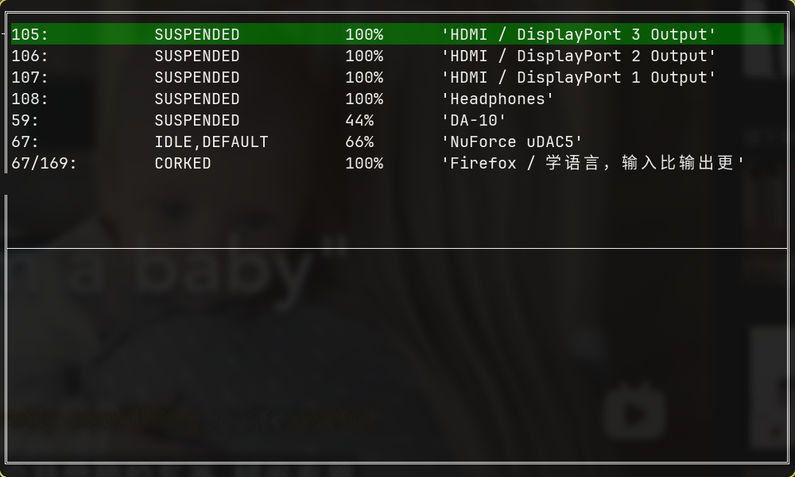

# pactl-wrapper
pactl wrappers , command line and tui by perl and raku

# Patcl.pl Usage
`pactl.pl` show sinks with inputs for zsh completion purpose

`pactl.pl 60/120 70/140 50` move input 120 belong to sink 60, and input 140 belong to sink 70, all to sink 50

`pactl.pl 60 70` move all inputs belong to sink 60 to sink 70

`pactl.pl -m 60` toggle sink mute

`pactl.pl -m 70/120` toggle input mute

`pactl.pl -v 60 +20` add sink 60 volume 20 percent

`pactl.pl -v 60 -- -20` minus sink 60 volume 20 percent

`pactl.pl -i 60` show sink 60 info

`pactl.pl -i 70/120` show input 120 info

# Pactltui.raku Usage
`patcltui.raku` open tui

space to toggle select sink or input, show legal action, enter to open confirm dialog

key u,d to raise up or lower volume

key m to toggle mute

key q to quti
